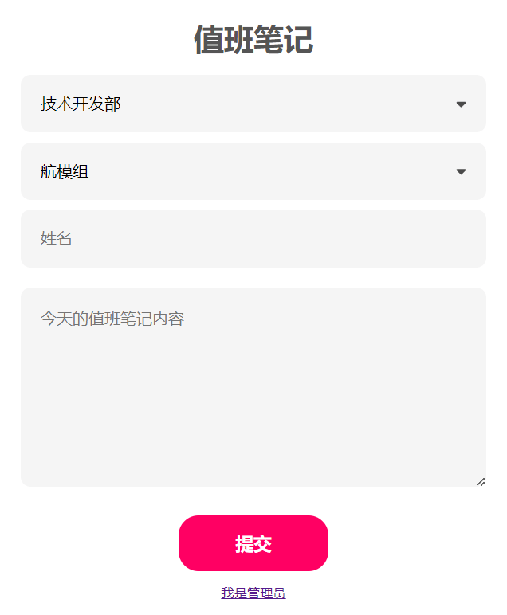

<h1>技术部值班笔记 </h1>

## 1. 预览



## 2. 准备数据库

### 2.1 创建新数据库

创建新的提交数据库，名称为`punch`：

```sql
CREATE DATABASE punch;
```

#### 2.1.1 创建提交Table

创建新的Table，名称为`punch`：

```sql
USE punch;

CREATE TABLE `punch`(
    `id` INT NOT NULL AUTO_INCREMENT PRIMARY KEY,
    `group` VARCHAR(10) NOT NULL,
    `name` VARCHAR(10) NOT NULL,
    `date` VARCHAR(10) DEFAULT (DATE_FORMAT(CURRENT_DATE, '%Y/%m/%d')) NOT NULL,
    `notes` VARCHAR(500) NOT NULL
);
```

#### 2.1.2 创建管理员Table

创建新的Table，名称为`admin`：

```sql
USE punch;

CREATE TABLE `admin`(
    `id` int NOT NULL AUTO_INCREMENT PRIMARY KEY,
    `username` VARCHAR(20) NOT NULL,
    `password` VARCHAR(100) NOT NULL
);
```

### 2.2 创建新用户

#### 2.2.1 punch_insert用户

创建新的MySQL用户，用户名为`punch_insert`，密码为`password`：

```sql
CREATE USER 'punch_insert'@'localhost' IDENTIFIED WITH mysql_native_password BY 'password';
```

授予`punch_insert`用户权限：

```sql
USE punch; GRANT INSERT, UPDATE, SELECT ON punch TO 'punch_insert'@'localhost' WITH GRANT OPTION;
```

#### 2.2.2 punch_select用户

创建新的MySQL用户，用户名为`punch_select`，密码为`password`：

```sql
CREATE USER 'punch_select'@'localhost' IDENTIFIED WITH mysql_native_password BY 'password';
```

授予`punch_select`用户权限：

```sql
USE punch; GRANT SELECT ON punch TO 'punch_select'@'localhost' WITH GRANT OPTION;
```

```sql
USE punch; GRANT SELECT ON admin TO 'punch_select'@'localhost' WITH GRANT OPTION;
```

#### 2.2.3 重置用户权限缓存

重置用户权限缓存：

```sql
FLUSH PRIVILEGES;
```

## 3. 启动服务器

克隆本文档：

```bash
git clone https://github.com/MR-Addict/punch.git
```

启动docker容器：

```bash
docker-compose up -d
```

## 4. 后台管理

后台账号请联系部长或者组长。
